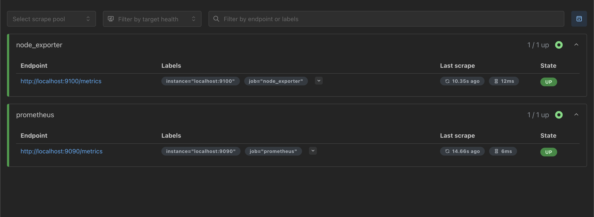
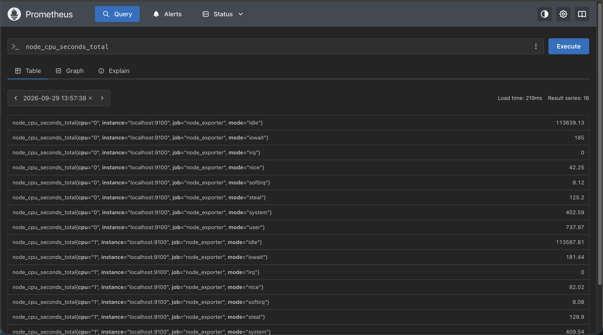
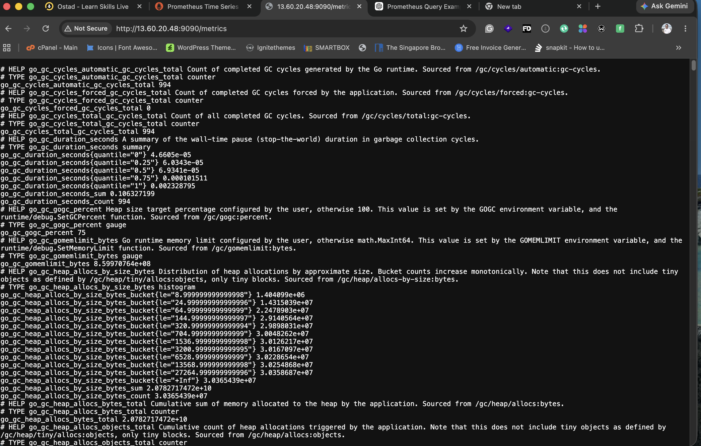
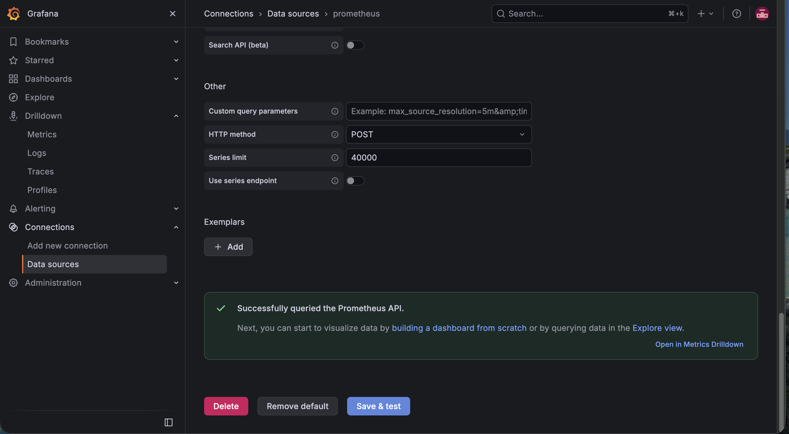
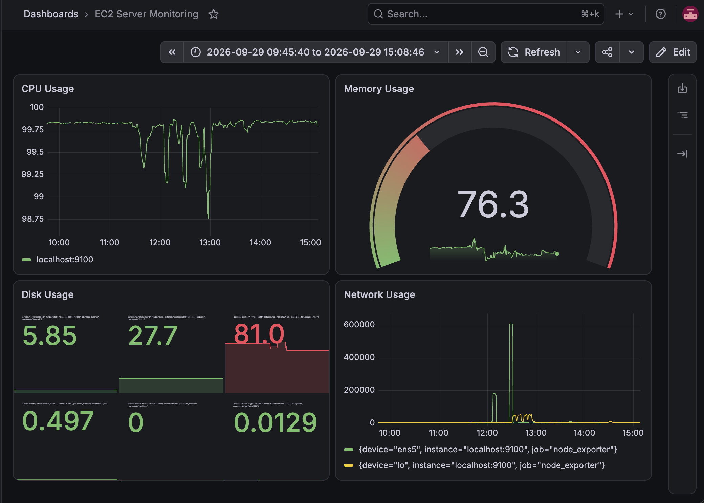
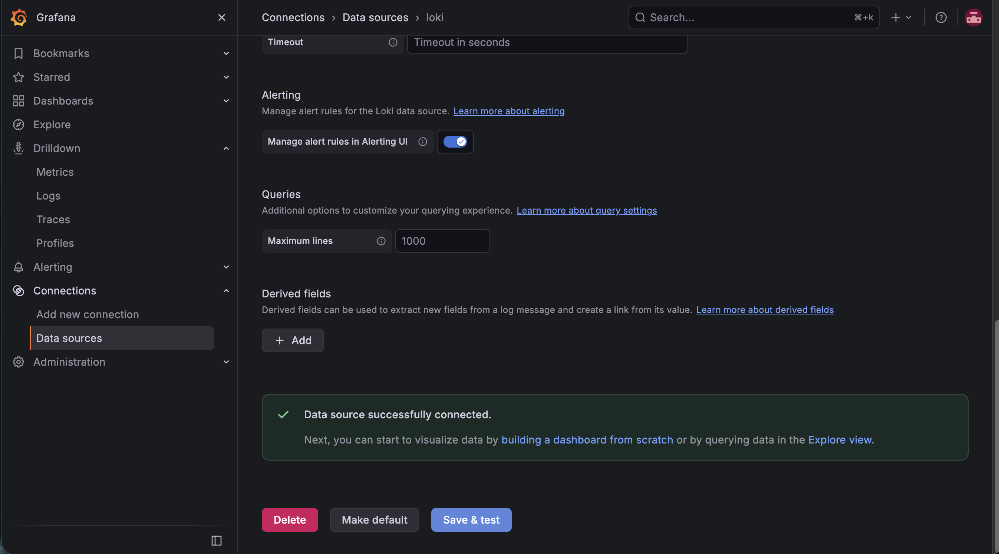
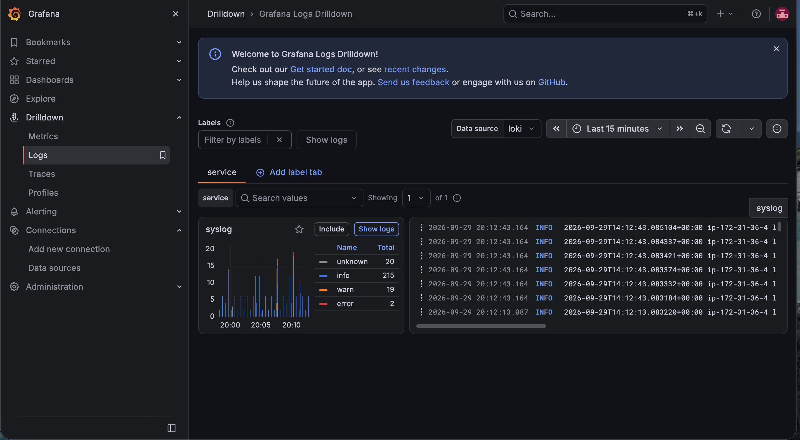
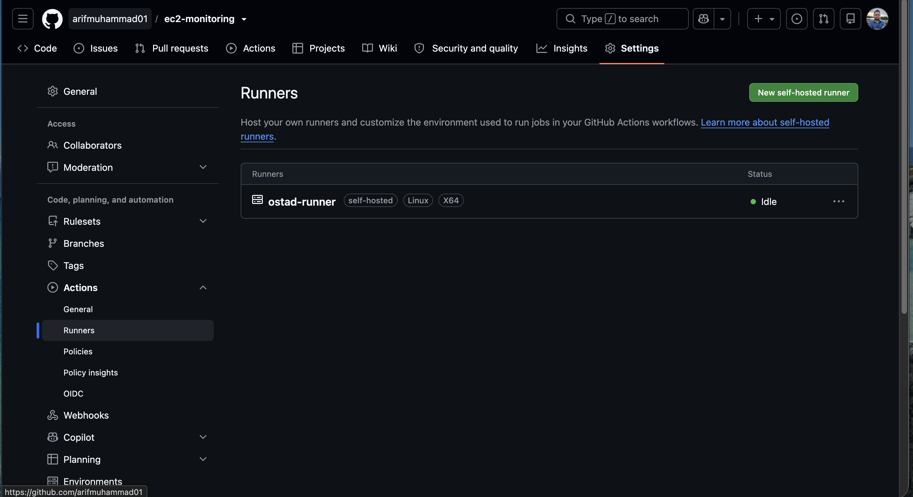
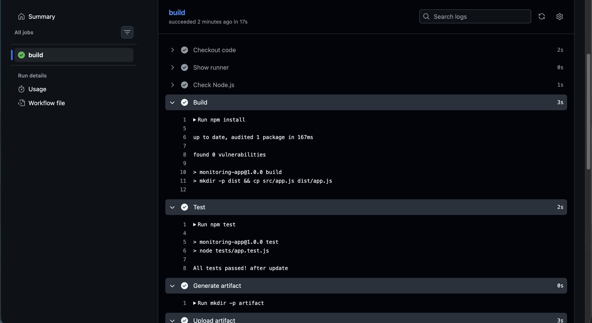
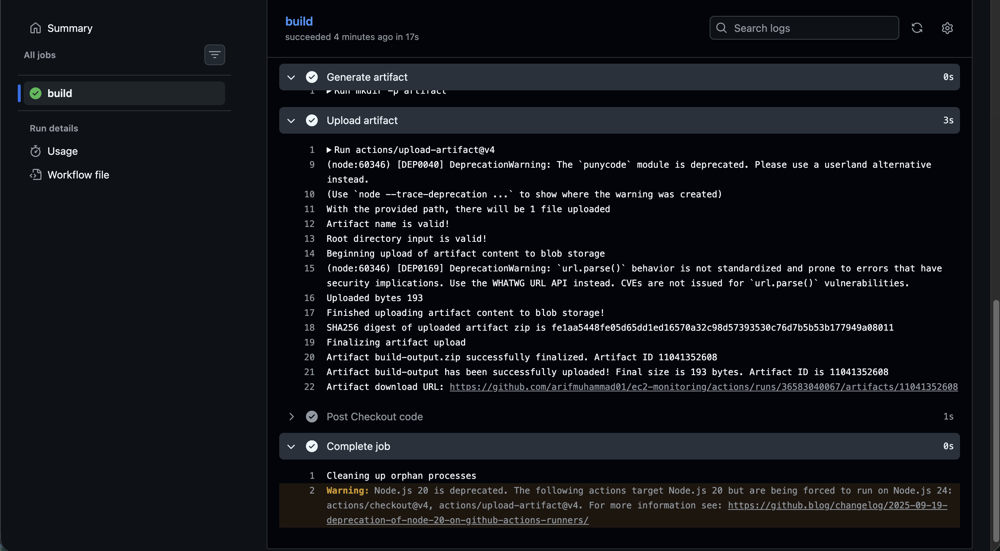

DevOps Batch 14 — Assignment
Assignment: Server Monitoring, Logging & CI Pipeline
Objective
Set up a basic DevOps environment on an Ubuntu server using Prometheus, Node Exporter, Grafana, Loki, and GitHub Actions.

Submitted By: Arif Muhammad

#Prometheus Configuration Start

# my global config
global:
  scrape_interval: 15s # Set the scrape interval to every 15 seconds. Default is every 1 minute.
  evaluation_interval: 15s # Evaluate rules every 15 seconds. The default is every 1 minute.
  # scrape_timeout is set to the global default (10s).

# Alertmanager configuration
alerting:
  alertmanagers:
    - static_configs:
        - targets:
          # - alertmanager:9093

# Load rules once and periodically evaluate them according to the global 'evaluation_interval'.
rule_files:
  # - "first_rules.yml"
  # - "second_rules.yml"

# A scrape configuration containing exactly one endpoint to scrape:
# Here it's Prometheus itself.
scrape_configs:
  - job_name: "prometheus"
    static_configs:
      - targets: ["localhost:9090"]

  - job_name: "node_exporter"
    static_configs:
      - targets: ["localhost:9100"]

#Prometheus Configuration End

#Loki Configuration Start
auth_enabled: false

server:
  http_listen_port: 3100
  grpc_listen_port: 9096

common:
  instance_addr: 127.0.0.1

  ring:
    kvstore:
      store: inmemory

  replication_factor: 1

  path_prefix: /var/lib/loki

schema_config:
  configs:
    - from: 2026-01-01
      store: tsdb
      object_store: filesystem
      schema: v13
      index:
        prefix: index_
        period: 24h

storage_config:
  filesystem:
    directory: /var/lib/loki/chunks

limits_config:
  reject_old_samples: true
  reject_old_samples_max_age: 168h

compactor:
  working_directory: /var/lib/loki/compactor
  retention_enabled: false

#Loki Configuration Ends

#Github Workflow

name: CI Pipeline

on:
  push:
    branches:
      - main

  pull_request:
    branches:
      - main

jobs:
  build:
    runs-on: self-hosted

    steps:
      - name: Checkout code
        uses: actions/checkout@v4

      - name: Build
        run: |
          npm install
          npm run build

      - name: Test
        run: |
          npm test

      - name: Generate artifact
        run: |
          mkdir -p artifact
          cp -r dist/* artifact/

      - name: Upload artifact
        uses: actions/upload-artifact@v4
        with:
          name: build-output
          path: artifact/

#Required Screenshots

#Prometheus Status

#Prometheus Query 

#Node Exporter Metrics

#Graphana Connected Prometheus Datasource

#Graphana Dashboard

#Graphana Connected Loki Datasource

#Graphana Showing Logs from Loki

#Github Repository Runner Online

#Github Actions Workflow

#Github Upload Artifact

#Github Artifact Download Page
